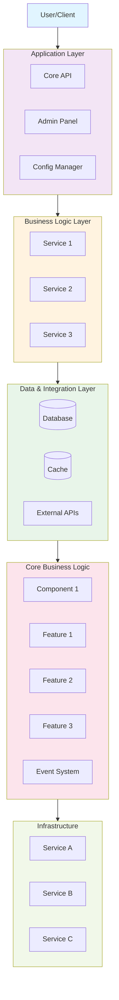

# 4. SYSTEM ARCHITECTURE & TECHNICAL DESIGN

**Connected to:** Section 3 (Scope), Section 5 (Timeline), Section 7 (Risk Management), Section 12 (Documentation)

---

## Architecture Vision Statement

[A 2-3 paragraph narrative describing your system architecture at a high level - how components interact, what problems it solves, design philosophy]

Example:
"[Your Product Name] is a [system type] that [primary purpose]. It eliminates the need for [complex process users currently do]. The architecture comprises [number] layers: (1) [Layer 1 description], (2) [Layer 2 description], and (3) [Layer 3 description]. The system prioritizes [key value proposition] by [how you achieve it], while allowing power users to customize via [customization method]. All components are decoupled through well-defined interfaces, enabling independent scaling and maintenance."

---

## High-Level System Architecture

### Visual Architecture Diagram



### ASCII Architecture Diagram (Alternative)

```
┌─────────────────────────────────────────────────────────┐
│                  USER/CLIENT                             │
└─────────────────────────────────────────────────────────┘
                            │
                            ▼
┌─────────────────────────────────────────────────────────┐
│              [Your Product Name] Application           │
│  ┌─────────────┬──────────────┬───────────────────┐    │
│  │ Core API    │ Admin Panel  │ Config Manager    │    │
│  └─────────────┴──────────────┴───────────────────┘    │
└─────────────────────────────────────────────────────────┘
                            │
                            ▼
┌─────────────────────────────────────────────────────────┐
│           [Business Logic Layer]                       │
│  ┌─────────────┬──────────────┬───────────────────┐    │
│  │ [Service 1] │ [Service 2] │ [Service 3]       │    │
│  └─────────────┴──────────────┴───────────────────┘    │
└─────────────────────────────────────────────────────────┘
                            │
                            ▼
┌─────────────────────────────────────────────────────────┐
│         [Data & Integration Layer]                      │
│  ┌──────────┬──────────┬──────────┬─────────────────┐  │
│  │[Database]│[Cache]   │[External]│ [Others...]     │  │
│  └──────────┴──────────┴──────────┴─────────────────┘  │
└─────────────────────────────────────────────────────────┘
                            │
                            ▼
┌─────────────────────────────────────────────────────────┐
│              [Core Business Logic Layer]                │
│  ┌──────────────────────────────────────────────────┐  │
│  │  [Component 1]                                   │  │
│  │  - [Feature 1]                                   │  │
│  │  - [Feature 2]                                   │  │
│  │  - [Feature 3]                                   │  │
│  │  - [Event System]                                │  │
│  └──────────────────────────────────────────────────┘  │
└─────────────────────────────────────────────────────────┘
                            │
                            ▼
┌─────────────────────────────────────────────────────────┐
│              [External Services / Infrastructure]        │
│  ([Service A], [Service B], [Service C], etc.)          │
└─────────────────────────────────────────────────────────┘
```

---

## Component Specification

### Component 1: [Component Name] (Technology Stack)

**Purpose:** [Primary purpose of this component - what it does for users]

**Responsibilities:**
- [Responsibility 1 - e.g., User interface and interaction]
- [Responsibility 2 - e.g., Configuration parsing and validation]
- [Responsibility 3 - e.g., Core functionality execution]
- [Responsibility 4 - e.g., Data processing and transformation]
- [Responsibility 5 - e.g., Event handling and notifications]
- [Responsibility 6 - e.g., Error handling and retry logic]
- [Responsibility 7 - e.g., Telemetry and logging]

**Key Interfaces:**
```typescript
class [ComponentName] {
  [method1](): Promise<[ReturnType]>
  [method2](params: [ParamType]): Promise<[ReturnType]>
  [method3](): Promise<[ReturnType]>
  [method4](handler: [HandlerType]): void
  [method5](params: [ParamType]): Promise<void>
}
```

**Dependencies:**
- [Dependency 1 - e.g., Library for core functionality]
- [Dependency 2 - e.g., TypeScript for type safety]
- [Dependency 3 - e.g., Testing framework]

**Technology Stack:**
- **Language:** TypeScript
- **Runtime:** Node.js 18+
- **Package Manager:** npm/yarn
- **Distributed As:** [Distribution method, e.g., npm package `@your-org/product-name`]

**Performance Requirements:**
- [Operation 1]: <[time] seconds
- [Operation 2]: <[time] milliseconds
- [Operation 3]: <[time] milliseconds latency

---

### Component 2: [Component Name] (Business Logic)

**Purpose:** [Core business logic and processing layer]

**Responsibilities:**
- [Responsibility 1 - e.g., Data processing and transformation]
- [Responsibility 2 - e.g., Business rule enforcement]
- [Responsibility 3 - e.g., Workflow orchestration]
- [Responsibility 4 - e.g., Event handling and notifications]
- [Responsibility 5 - e.g., Performance optimization]

**Key Classes/Modules:**

**[MainClass]** (Core business logic)
```typescript
class [MainClass] {
  // [Property description]
  private [property]: [Type];
  
  // [Method description]
  [method1](params: [ParamType]): Promise<[ReturnType]>;
  
  // [Method description]
  [method2](params: [ParamType]): Promise<[ReturnType]>;
  
  // [Method description]
  [method3](key: string): Promise<[ReturnType]>;
  
  // [Method description]
  [method4](key: string, value: [Type]): Promise<void>;
}
```

**[FactoryClass]** (Object creation)
```typescript
class [FactoryClass] {
  [createMethod](params: [ParamType]): Promise<[ReturnType]>;
}
```

**Technology Stack:**
- **Language:** [Language, e.g., TypeScript, Python, Java, etc.]
- **Framework:** [Framework, e.g., Express, FastAPI, Spring, etc.]
- **Standards:** [Relevant standards or patterns]
- **Performance Target:** <[X] ms per operation, <[Y] ms per request

**Quality Requirements:**
- 80%+ test coverage (unit + integration)
- Code review required for all changes
- Performance benchmarks met

---

### Component 3: [Component Name] (Data & Integration)

**Purpose:** [Data management and external service integration]

**Responsibilities:**
- [Responsibility 1 - e.g., Database connection and query management]
- [Responsibility 2 - e.g., External API integration]
- [Responsibility 3 - e.g., Data caching and optimization]
- [Responsibility 4 - e.g., Service registry and discovery]
- [Responsibility 5 - e.g., Error handling and retry logic]

**Supported Integrations:**
| Service | Provider | Environment | Status | Owner |
|---------|----------|-------------|--------|-------|
| [Service 1] | [Provider] | Staging | ✅ Phase 2 | [Name] |
| [Service 2] | [Provider] | Staging | ✅ Phase 2 | [Name] |
| [Service 3] | [Provider] | Production | ✅ Phase 2 | [Name] |
| [Service 4] | [Provider] | Staging | ❓ Phase 3 | [Name] |
| [Service 5] | [Provider] | Planning | ❓ Phase 4 | [Name] |

**Integration Interface:**
```typescript
interface [IntegrationInterface] {
  name: string;
  endpoint: string;
  [method1](params: [ParamType]): Promise<[ReturnType]>;
  [method2](params: [ParamType]): Promise<[ReturnType]>;
  [method3](id: string): Promise<[ReturnType]>;
  [method4](params: [ParamType]): Promise<[ReturnType]>;
}
```

---

### Component 4: [Component Name] (Admin/Management Interface)

**Purpose:** [Administrative interface for system management]

**Responsibilities:**
- [Responsibility 1 - e.g., User and role management]
- [Responsibility 2 - e.g., System configuration]
- [Responsibility 3 - e.g., Monitoring and analytics]
- [Responsibility 4 - e.g., Deployment and release management]
- [Responsibility 5 - e.g., Log viewing and troubleshooting]

**Key Features:**
```bash
# Initialize new project/environment
[command] init [project-name]

# Deploy to staging
[command] deploy --environment staging

# Deploy to production
[command] deploy --environment production

# Update configuration
[command] config --key "setting-name" --value "setting-value"

# Run tests
[command] test --config config.yaml

# View logs
[command] logs --service service-name

# Generate code/documentation
[command] generate --source ./source
```

---

### Component 5: API & Event System

**Purpose:** [API endpoints and real-time event handling]

**Responsibilities:**
- [Responsibility 1 - e.g., Webhook delivery for events]
- [Responsibility 2 - e.g., REST API for queries]
- WebSocket support for real-time updates
- Event filtering and aggregation

**API Endpoints:**

| Endpoint | Method | Purpose |
|----------|--------|---------|
| `/[resource]` | GET | List all [resources] |
| `/[resource]/{id}` | GET | Get [resource] details |
| `/[resource]/{id}/[action]` | POST | Execute [action] |
| `/[resource]/{id}/[config]` | GET/PUT | Get/update [configuration] |
| `/[resource]/{id}/events` | GET | Get event history |
| `/[resource]/{id}/subscribe` | POST | Subscribe to events (webhook) |

**Event Types:**
- `[Event1]` - [Event description]
- `[Event2]` - [Event description]
- `[Event3]` - [Event description]
- `Error` - [Error event description]

---

## Architecture Decisions (ADRs)

### ADR-001: [Architecture Decision Title]

**Status:** [Proposed / Accepted / Deprecated]

**Context:**
[Problem statement and question]. Two approaches:
1. **Option 1:** [Description] ([pros], [cons])
2. **Option 2:** [Description] ([pros], [cons])

**Decision:** [Selected approach]

**Rationale:**
- [Reason 1 - e.g., 90% of users want pre-built solutions]
- [Reason 2 - e.g., Faster time-to-market]
- [Reason 3 - e.g., Standardized patterns improve maintainability]
- [Reason 4 - e.g., Power users can still customize when needed]

**Consequences:**
- ✅ [Positive consequence 1]
- ✅ [Positive consequence 2]
- ❌ [Negative consequence 1]
- ❌ [Negative consequence 2]

**Trade-offs:**
- Chose [priority] over [alternative priority]
- Can add [future enhancement] later if needed

---

### ADR-002: [Architecture Decision Title]

**Status:** [Proposed / Accepted / Deprecated]

**Context:**
Should [Product Name] support [multiple options] or focus on [single option] initially?

**Alternatives:**
1. **Option 1:** [Description]
2. **Option 2:** [Description]
3. **Option 3:** [Description]

**Decision:** [Selected option]

**Rationale:**
- [Reason 1 - e.g., Users want flexibility]
- [Reason 2 - e.g., Architecture supports multiple options]
- [Reason 3 - e.g., Reduces vendor lock-in]
- [Reason 4 - e.g., Covers majority of use cases]

**Consequences:**
- ✅ [Positive consequence 1]
- ✅ [Positive consequence 2]
- ❌ [Negative consequence 1]
- ❌ [Negative consequence 2]

**Trade-offs:**
- Chose [priority] over [alternative priority]
- Will add [future enhancement] based on user demand

---

### ADR-003: [Architecture Decision Title]

**Status:** [Proposed / Accepted / Deprecated]

**Context:**
[Problem statement and question]. Two approaches:
1. **Option 1:** [Description] ([pros], [cons])
2. **Option 2:** [Description] ([pros], [cons])

**Decision:** [Selected approach with fallback strategy]

**Rationale:**
- [Reason 1 - e.g., Enables advanced features]
- [Reason 2 - e.g., Aligns with industry standards]
- [Reason 3 - e.g., Better user experience]
- [Reason 4 - e.g., Fallback ensures compatibility]

**Consequences:**
- ✅ [Positive consequence 1]
- ✅ [Positive consequence 2]
- ❌ [Negative consequence 1]
- ❌ [Negative consequence 2]

**Trade-offs:**
- Chose [priority] over [alternative priority]
- [Fallback strategy] minimizes risk

---

### ADR-004: [Architecture Decision Title]

**Status:** [Proposed / Accepted / Deprecated]

**Context:**
Should [Product Name] support [single technology] or [multiple technologies]?

**Decision:** [Selected approach with future expansion plan]

**Rationale:**
- [Reason 1 - e.g., Primary technology has best ecosystem]
- [Reason 2 - e.g., Targeting specific developer segment first]
- [Reason 3 - e.g., Technology has best tooling for our use case]
- [Reason 4 - e.g., Multi-technology support can be added later]

**Consequences:**
- ✅ [Positive consequence 1]
- ✅ [Positive consequence 2]
- ❌ [Negative consequence 1]
- ❌ [Negative consequence 2]

**Trade-offs:**
- Chose [priority] over [alternative priority]
- [Future technology] support planned for [phase] based on demand

---

### ADR-005: [Architecture Decision Title]

**Status:** [Proposed / Accepted / Deprecated]

**Context:**
[Problem statement and question]. Trade-off between [option 1] and [option 2].

**Decision:** [Selected approach]

**Rationale:**
- [Reason 1 - e.g., License allows commercial use]
- [Reason 2 - e.g., Community contributions improve codebase]
- [Reason 3 - e.g., Alternative revenue streams available]
- [Reason 4 - e.g., Aligns with community values]

**Consequences:**
- ✅ [Positive consequence 1]
- ✅ [Positive consequence 2]
- ❌ [Negative consequence 1]
- ❌ [Negative consequence 2]

**Trade-offs:**
- Chose [priority] over [alternative priority]
- Will monetize through [alternative revenue model]

---

## Non-Functional Requirements

### Performance

| Requirement | Target | Measurement | Owner |
|-------------|--------|-------------|-------|
| [Operation 1] | <[time] | [Description] | [Owner] |
| [Operation 2] | <[time] | [Description] | [Owner] |
| API Response Time (P95) | <200ms | Endpoint latency | DevOps |
| [Operation 4] | <[time] | [Description] | [Owner] |

### Security

| Requirement | Target | Measurement | Owner |
|-------------|--------|-------------|-------|
| Security Audit | Zero critical vulnerabilities | External audit report | Security Lead |
| Code Review Coverage | 100% of commits reviewed | GitHub PR requirements | Tech Lead |
| Dependency Scanning | Zero high-risk dependencies | Snyk scan results | DevOps |
| Secrets Management | Zero hardcoded secrets | Code scanning + policies | DevOps |

### Reliability

| Requirement | Target | Measurement | Owner |
|-------------|--------|-------------|-------|
| System Uptime | 99.5% | Monitoring dashboard | DevOps |
| Mean Time to Recovery (MTTR) | <1 hour | Incident tracking | DevOps |
| Backup & Restore | Weekly backups, <4hr RTO | Disaster recovery drill | DevOps |

### Scalability

| Requirement | Target | Measurement | Owner |
|-------------|--------|-------------|-------|
| Concurrent API Requests | 10,000+ QPS | Load testing | Backend Lead |
| [Metric Name] | [Target Value] | [Measurement Method] | [Owner] |
| Data Storage | <[X] GB database | Database size monitoring | DevOps |

### Maintainability

| Requirement | Target | Measurement | Owner |
|-------------|--------|-------------|-------|
| Code Coverage | 80%+ | Coverage reports | QA Lead |
| Documentation | 100% of public APIs | Doc coverage tools | Tech Lead |
| Onboarding Time | <2 hours new dev | Tracked against checklist | Tech Lead |

---

## Technology Stack Summary

| Layer | Technology | Rationale |
|-------|-----------|-----------|
| [Technology Category] | [Technology Choice] | [Rationale] |
| [Technology Category] | [Technology Choice] | [Rationale] |
| [Technology Category] | [Technology Choice] | [Rationale] |
| Package Distribution | npm | Standard for JavaScript packages |
| API Framework | Express.js or Fastify | Lightweight, proven framework |
| Testing | Jest + [Testing Framework] | Unit + integration tests |
| Database | PostgreSQL or MongoDB | TBD based on data model |
| Monitoring | Datadog or Grafana | Real-time dashboards and metrics |
| CI/CD | GitHub Actions | Integrated with GitHub repo |
| Cloud Hosting | Render or Railway | Cost-effective for startup phase |

---

**This architecture is your technical north star. Decisions made here cascade to all implementation work.**

**Connected to:** Section 3 (Scope), Section 5 (Timeline), Section 6 (Resources), Section 8 (Execution)
