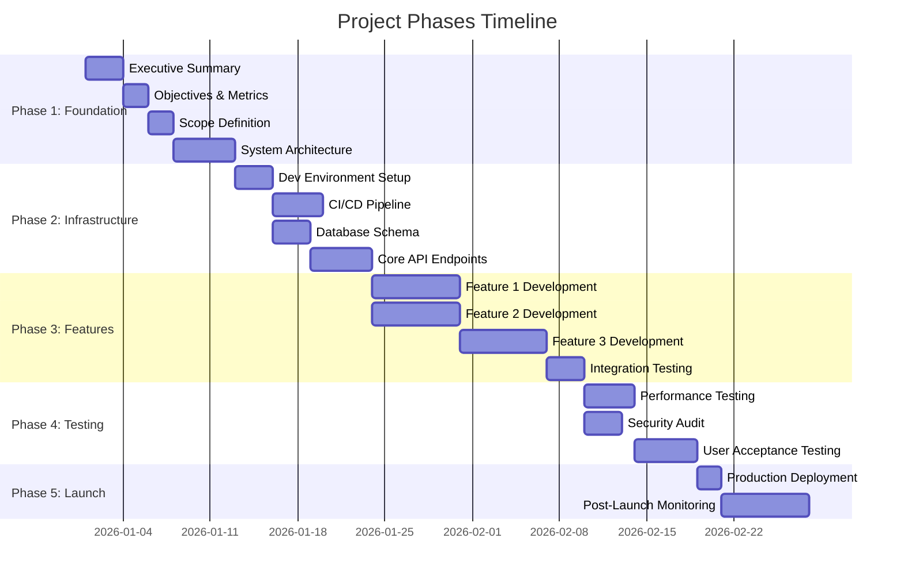
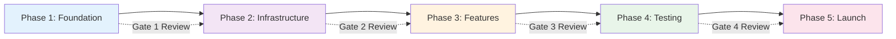

# 6. PROJECT PHASES & TIMELINE

**Project Name:** [Your Project Name]  
**Owner/Lead:** [Your Name]  
**Created:** [MM/DD/YYYY]  
**Status:** [Planning / In Progress / On Hold / Completed]

---

## Overview

This document defines the project phases, milestones, critical path, dependencies, and gate review criteria. It provides a clear timeline for execution and identifies when key deliverables must be completed.

**Connections:** Uses Sections 3 (Scope), 4 (Architecture); Feeds into Sections 6 (Resources), 7 (Risks), 8 (Execution)

---

## Project Timeline Overview

### Gantt Chart



### Critical Path Diagram



## Phase Breakdown

### Phase 1: Foundation & Planning
**Duration:** [Weeks 1-2]  
**Goal:** Establish technical foundation and complete planning

**Deliverables:**
- [ ] Executive Summary completed
- [ ] Objectives & Success Metrics defined
- [ ] Scope Definition finalized
- [ ] System Architecture documented
- [ ] Tech stack selected and justified
- [ ] Initial ADRs created (3-5 decisions)
- [ ] Team structure defined
- [ ] Budget approved

**Gate 1 Review Criteria:**
- All planning sections (1-4) complete
- Architecture approved by technical leadership
- Budget and resources allocated
- Team members assigned

**Dependencies:**
- None (foundation phase)

**Risks:**
- Planning takes longer than expected
- Architecture decisions delayed
- Team availability issues

---

### Phase 2: Technical Foundation
**Duration:** [Weeks 3-4]  
**Goal:** Build core infrastructure and development environment

**Deliverables:**
- [ ] Development environment setup
- [ ] CI/CD pipeline operational
- [ ] Code standards defined and enforced
- [ ] Database schema designed and implemented
- [ ] Core API endpoints developed
- [ ] Authentication system integrated
- [ ] Testing framework configured
- [ ] Monitoring and logging setup

**Gate 2 Review Criteria:**
- CI/CD pipeline passing all tests
- Code review process established
- Development environment documented
- Core infrastructure deployed to staging

**Dependencies:**
- Phase 1 complete (architecture decisions)
- Tech stack selected

**Risks:**
- Infrastructure setup delays
- Integration issues with third-party services
- Performance bottlenecks discovered

---

### Phase 3: Core Features Development
**Duration:** [Weeks 5-8]  
**Goal:** Build MVP features per scope definition

**Deliverables:**
- [ ] Feature 1: [Description]
- [ ] Feature 2: [Description]
- [ ] Feature 3: [Description]
- [ ] Feature 4: [Description]
- [ ] Feature 5: [Description]
- [ ] Integration testing complete
- [ ] Performance testing complete
- [ ] Security audit completed

**Gate 3 Review Criteria:**
- All MVP features functional
- Test coverage above 80%
- Performance benchmarks met
- Security vulnerabilities addressed
- User acceptance testing passed

**Dependencies:**
- Phase 2 complete (infrastructure ready)
- Database schema finalized

**Risks:**
- Feature complexity underestimated
- Integration challenges
- Third-party API limitations

---

### Phase 4: Testing & Refinement
**Duration:** [Weeks 9-10]  
**Goal:** Comprehensive testing, bug fixes, and optimization

**Deliverables:**
- [ ] End-to-end testing complete
- [ ] Load testing complete
- [ ] Security penetration testing
- [ ] Bug fixes and refinements
- [ ] Performance optimization
- [ ] Documentation complete
- [ ] User training materials
- [ ] Deployment runbooks

**Gate 4 Review Criteria:**
- Zero critical bugs
- Performance targets met
- Security audit passed
- Documentation complete
- Team trained on operations

**Dependencies:**
- Phase 3 complete (features developed)

**Risks:**
- Critical bugs discovered late
- Performance issues require architecture changes
- Security vulnerabilities found

---

### Phase 5: Launch & Post-Launch
**Duration:** [Weeks 11-12]  
**Goal:** Production launch and initial monitoring

**Deliverables:**
- [ ] Production environment configured
- [ ] Launch checklist complete
- [ ] Monitoring dashboards active
- [ ] Support process operational
- [ ] Post-launch review completed
- [ ] Lessons learned documented
- [ ] Next phase planning initiated

**Gate 5 Review Criteria:**
- Production launch successful
- Monitoring shows healthy metrics
- Support process handling issues
- User feedback collected
- Success metrics tracked

**Dependencies:**
- Phase 4 complete (testing and refinement)

**Risks:**
- Launch day issues
- Unexpected user behavior
- Scaling challenges

---

## Critical Path Analysis

**Critical Path:** The sequence of tasks that determines the minimum project duration.

```
Phase 1 (Planning) → Phase 2 (Infrastructure) → Phase 3 (Features) → Phase 4 (Testing) → Phase 5 (Launch)
```

**Critical Path Tasks:**
1. Architecture decisions (Phase 1)
2. CI/CD pipeline setup (Phase 2)
3. Core feature development (Phase 3)
4. Integration testing (Phase 4)
5. Production deployment (Phase 5)

**Non-Critical Tasks (Can be done in parallel):**
- Documentation writing
- Training material creation
- Marketing preparation
- Support process setup

---

## Milestone Schedule

| Milestone | Target Date | Deliverable | Owner |
|-----------|-------------|-------------|-------|
| M1: Planning Complete | [Date] | Sections 1-4 complete | [Name] |
| M2: Infrastructure Ready | [Date] | CI/CD operational | [Name] |
| M3: MVP Features Complete | [Date] | All MVP features functional | [Name] |
| M4: Testing Complete | [Date] | All tests passing | [Name] |
| M5: Production Launch | [Date] | System live in production | [Name] |

---

## Dependencies Map

```
Planning (Phase 1)
    ↓
Infrastructure (Phase 2) ← Tech Stack Decision
    ↓
Features (Phase 3) ← Database Schema
    ↓
Testing (Phase 4) ← Feature Development
    ↓
Launch (Phase 5) ← Testing Complete
```

**External Dependencies:**
- Third-party API availability
- Vendor delivery timelines
- Regulatory approvals (if applicable)
- Infrastructure provisioning

---

## Risk-Adjusted Timeline

**Optimistic Scenario:** [X weeks]
- All phases complete on time
- No major blockers
- Team at full capacity

**Realistic Scenario:** [X weeks]
- Minor delays in 1-2 phases
- Some blockers resolved quickly
- Team at 80% capacity

**Pessimistic Scenario:** [X weeks]
- Major delays in 2+ phases
- Significant blockers
- Team capacity issues

**Contingency Buffer:** [X weeks] added to realistic timeline

---

## Gate Review Process

### Gate Review Checklist

**Before each gate review:**
- [ ] All deliverables for phase complete
- [ ] Quality criteria met
- [ ] Documentation updated
- [ ] Stakeholders notified
- [ ] Review meeting scheduled

**During gate review:**
- [ ] Review deliverables
- [ ] Assess quality criteria
- [ ] Identify blockers
- [ ] Make go/no-go decision
- [ ] Approve next phase

**After gate review:**
- [ ] Document decisions
- [ ] Update timeline if needed
- [ ] Communicate outcomes
- [ ] Proceed to next phase

---

## Timeline Tracking

**Current Status:** [Phase X, Week Y]

**Progress:**
- Phase 1: [X]% complete
- Phase 2: [X]% complete
- Phase 3: [X]% complete
- Phase 4: [X]% complete
- Phase 5: [X]% complete

**Next Milestone:** [Milestone Name] - [Target Date]

**Blockers:** [List any current blockers]

---

## Change Control

**Timeline Changes:**
- Minor adjustments (<1 week): Project Lead approval
- Moderate changes (1-2 weeks): Technical Lead + Product Lead approval
- Major changes (>2 weeks): Steering committee approval

**Process:**
1. Document change request
2. Assess impact on dependencies
3. Update timeline and communicate
4. Get required approvals
5. Update this document

---

## Success Criteria

**Phase 1 Success:**
- Planning documents complete and approved
- Architecture decisions documented
- Team aligned on vision

**Phase 2 Success:**
- Infrastructure operational
- Development workflow established
- Quality gates in place

**Phase 3 Success:**
- MVP features functional
- Integration complete
- Performance acceptable

**Phase 4 Success:**
- All tests passing
- Security validated
- Documentation complete

**Phase 5 Success:**
- Production launch successful
- Monitoring active
- Users onboarded

---

**Last Updated:** [Date]  
**Next Review:** [Date]  
**Owner:** [Name]

